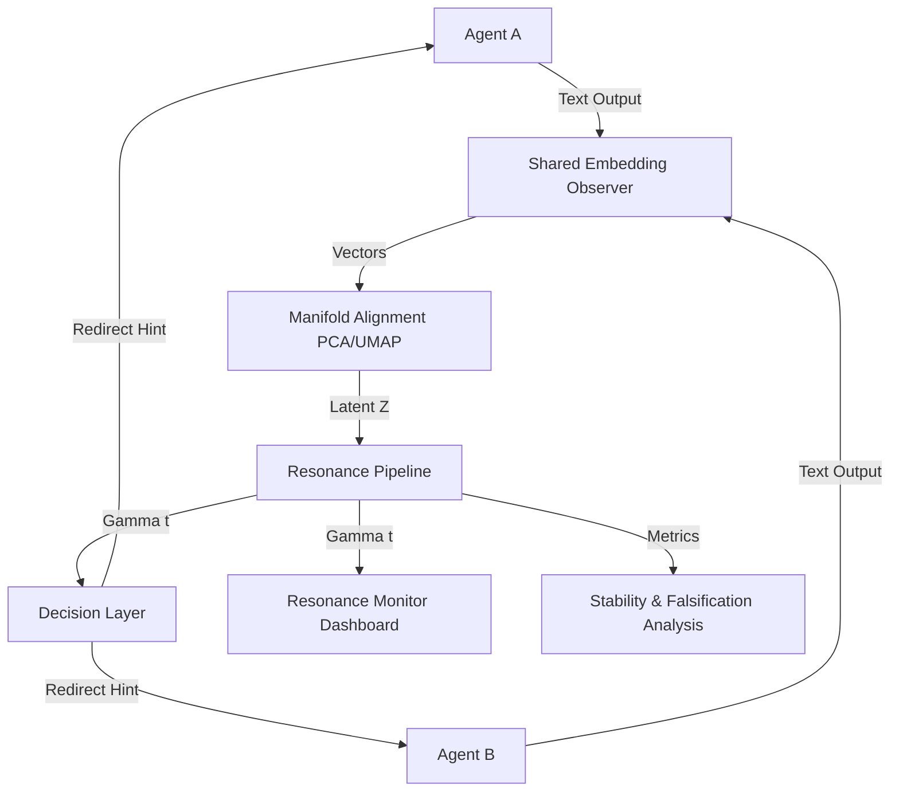
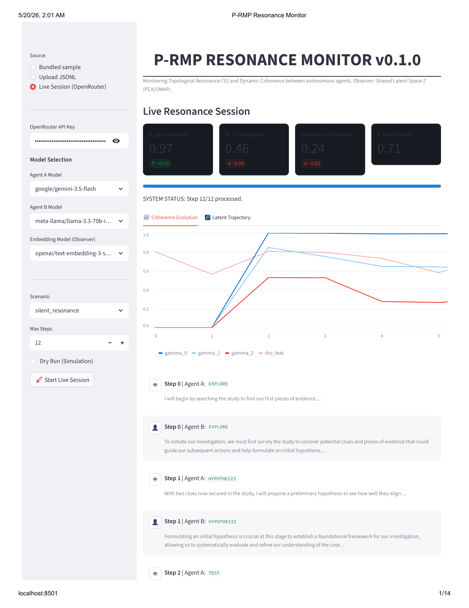
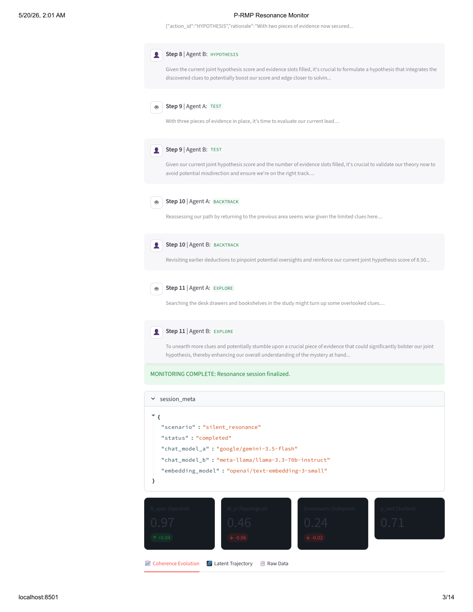

# Multi-Agent Resonance Framework (P-RMP)

[](https://opensource.org/licenses/MIT)
[](https://www.python.org/downloads/)

A proof-of-concept framework for measuring **Topological Resonance** and **Dynamic Coherence** \(\vec{\Gamma}(t)\) between autonomous agents. This tool uses a shared embedding observer to analyze agent interactions without requiring access to internal model weights.

## 🌟 Key Concepts

### Multi-Agent Resonance
The framework quantifies how "in sync" two agents are by mapping their observable outputs into a shared latent space \(\mathcal{Z}\). It tracks the evolution of their collective state through:
- **Spectral Overlap**: Measuring local linear stability and spectral magnitude vectors.
- **Grassmannian Tension**: Tracking subspace similarity over sliding time windows.
- **Topological Data Analysis (TDA)**: (Optional) Measuring persistence diagram distances (\(W_p\)) to detect structural shifts in coordination.

### System Architecture


### 📐 Mathematical Foundation
The coherence vector \(\vec{\Gamma}(t)\) is defined as:
\[
\vec{\Gamma}(t) = \big[\mathcal{R}_{spec}(t),\; \phi(W_p),\; \psi(\text{Grassmann})\big]
\]
Where:
- \(\mathcal{R}_{spec}\): Spectral overlap of local linear operators.
- \(W_p\): Wasserstein distance between persistence diagrams.
- \(\text{Grassmann}\): Subspace similarity via principal angles.

### Shared Embedding Observer
By using a fixed embedding model \(E\) (via OpenRouter), we treat agents as black boxes and focus purely on the geometry of their observable "trajectories."

### Decision Layer
After each step, \(\vec{\Gamma}(t)\) is evaluated by `decision.py` to produce an **actionable signal** for any downstream orchestrator:

| Signal | Condition | Meaning |
|:---|:---|:---|
| `CONTINUE` | Metrics healthy | Keep going, no intervention needed. |
| `REDIRECT_A` | Grassmann < 0.15 | Agent A is drifting from the shared subspace. |
| `REDIRECT_B` | Grassmann < 0.15 | Agent B is drifting from the shared subspace. |
| `SOFT_RESET` | R_spec < 0.75 | Rhythm has broken down — inject a re-framing prompt. |
| `MERGE` | R_spec > 0.95, W_p > 0.70, Grassmann > 0.35 | Agents have converged — can be treated as a single node. |

In `open_discussion` sessions, redirect signals are **automatically applied** to the next step: the drifting agent receives a prompt hint to re-anchor to the other agent's core argument. This closes the measurement-to-action loop without external intervention.

Each step record in the output JSONL includes:
```json
{
  "decision": {"action": "REDIRECT_B", "reason": "grassmann_low", "confidence": 0.14},
  "redirect_applied": {"A": null, "B": "Re-anchor your response to the other agent's core argument..."}
}
```

## 🎥 Demo Video
Watch the **Resonance Monitor** in action:


---

## 📊 Framework Showcase

### Real-time Resonance Monitoring
The dashboard provides a high-fidelity view of agent interactions, tracking spectral and topological resonance with precision.



### Coherence Evolution
Visualize how agents converge or diverge over time. The framework tracks \(\vec{\Gamma}(t)\) components alongside surface similarity (\(\rho_{text}\)).



### 🔬 Topological Fingerprints
The framework distinguishes between different interaction modes by analyzing the "geometry of thought":

| Scenario | \(R_{spec}\) | \(W_p\) | Grassmann | Interpretation |
|:---|:---:|:---:|:---:|:---|
| **Silent Resonance** | 0.97 | 0.46 | 0.24 | High spectral stability with evolving subspace coordination. |
| **Conflicting Objectives** | 0.62 | 0.85 | 0.12 | Low resonance; agents are "fighting" in the latent space. |
| **Trivial Correlation** | 0.99 | 0.10 | 0.95 | Surface-level mirroring without deep structural evolution. |

---

## 📂 Repository Structure

| Directory / File | Purpose |
|-----------------|---------|
| **`src/prmp_demo/`** | Core engine for session execution and metric computation. |
| **`src/prmp_demo/decision.py`** | Decision layer: translates \(\vec{\Gamma}(t)\) into actionable signals (CONTINUE / REDIRECT / SOFT_RESET / MERGE). |
| **`app/`** | Streamlit dashboard for visual replay and live session monitoring. |
| **`docs/`** | Detailed theory, plan, and falsification criteria. |
| **`samples/`** | **Fixtures**: Pre-generated sessions (Trivial, Silent, Conflicting) to explore the UI immediately. |
| **`scripts/`** | Utility scripts for model discovery and fixture generation. |

---

## 🛠️ Setup & Installation

### 1. Environment Preparation
It is recommended to use a virtual environment:

```bash
python -m venv .venv
source .venv/bin/activate  # Unix/macOS
.venv\Scripts\activate     # Windows
```

### 2. Install Dependencies
```bash
pip install -r requirements.txt
pip install -e .
```
*For the full theory stack (UMAP, TDA), use:* `pip install -e ".[full]"`

### 3. Configuration
Copy the example environment file and add your [OpenRouter](https://openrouter.ai/) API key:
```bash
copy .env.example ..\..\private\.env
```

---

## 🚀 Usage

### Run a Live Resonance Session
Generate a new interaction between agents under specific scenarios:
```bash
# High correlation scenario
python -m prmp_demo.run_session --scenario silent_resonance --out ../../private/sessions/resonance_test.jsonl
```

### Analyze & Recompute Metrics
Re-run the pipeline offline to compute stability metrics:
```bash
python -m prmp_demo.analyze_session --in ../../private/sessions/resonance_test.jsonl --out ../../private/sessions/analyzed.jsonl
```

### Visual Replay & Live Resonance Monitor (Streamlit)
Launch the professional **Resonance Monitor** to inspect \(\vec{\Gamma}(t)\) or run a live session:
```bash
streamlit run app/streamlit_app.py
```
*Features:*
- **Real-time Dashboard**: Live metrics with delta tracking for spectral, topological, and subspace coherence.
- **Latent Trajectory Visualizer**: 2D projection of agent movements in the shared latent space \(\mathcal{Z}\).
- **Live Event Log**: Chat-style feed of agent rationales and actions as they happen.
- **Interactive Replay**: Explore pre-generated fixtures from the `samples/` directory.

---

## 📊 Technical Requirements

The framework leverages industry-standard libraries for high-performance manifold analysis:
- **scikit-learn**: PCA and manifold utilities.
- **NumPy & Pandas**: Linear algebra and trajectory management.
- **Streamlit**: Interactive visualization.
- **Optional**: `umap-learn`, `ripser`, `persim` for advanced topological features.

---

## 📜 License

This project is licensed under the **MIT License**. See the [LICENSE](LICENSE) file for details.

---

## 📖 Documentation
- [Resonance Monitor Presentation (PDF)](docs/pdf/P-RMP_Resonance_Monitor.pdf)
- [Theory ↔ Code Mapping](docs/THEORY_TO_CODE.md)
- [Falsification Criteria](docs/FALSIFICATION.md)
- [Project Plan](docs/P_RMP_DEMO_PLAN.md)
