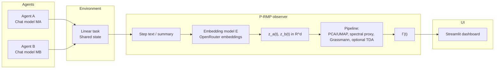

# Implementation plan: live P-RMP demo via OpenRouter

## 0) Claim the demo illustrates

**Displayed claim:** One can measure “dynamic coherence” between two language-agent trajectories in a shared temporal representation such that **strategic / semantic resonance** appears despite wording divergence (scenario B), while **verbatim mimicry** (scenario A) is not mistaken for deep resonance when task + metrics are designed carefully.

**Explicit constraints (for the research community):** OpenRouter does not expose hidden states for chat models. The observer operates on a **fixed external encoding** of agent behavior each step (step text or state summary) via a **single embedding model** from `/api/v1/embeddings/models`. This measures an “observable semantics trajectory,” not internal layers; state this in the UI and falsification notes.

---

## 1) System architecture (fixed components)



| Component | Suggested tech | Notes |
|-----------|----------------|-------|
| Agents | `POST /api/v1/chat/completions`, two distinct models (`MA`, `MB`) | Structured messages (JSON or fixed format) for extracting step actions |
| Unified observer | `POST /api/v1/embeddings`, fixed model `E` (e.g. `openai/text-embedding-3-small`) | Same `E` and parameters per agent per experiment |
| Storage | JSONL files or SQLite | Re-run analysis without re-calling chat |
| UI | Streamlit | Update each step or after session completes |

**Existing script:** `scripts/openrouter_discover_models.py` to explore models and smoke-test embeddings.

---

## 2) Phase 1 — Environment setup

### 2.1 Repository layout (reference)

```
workspace/                         # parent directory on your machine
  .gitignore                       # workspace-level ignores (never commit private/)
  README.md                        # optional short pointer — full docs live under github/

  github/                          # push this tree to GitHub (no secrets)
    README.md
    REPOSITORY_LAYOUT.md
    pyproject.toml
    requirements.txt
    .env.example
    docs/
      P_RMP_DEMO_PLAN.md           # This file
      pdf/                         # replay PDFs — verify no personal data before push
      ...
    src/prmp_demo/
    app/streamlit_app.py
    scripts/
    tests/
    samples/demo_*.jsonl

  private/                         # never upload
    README.md                      # only this file may be tracked by git
    .env                           # gitignored — user-created
    sessions/                      # gitignored — live JSONL exports
```

### 2.2 Environment variables

- `OPENROUTER_API_KEY`
- `PRMP_CHAT_MODEL_A`, `PRMP_CHAT_MODEL_B`
- `PRMP_EMBEDDING_MODEL` (fixed across experiments)
- Optional: `HTTP-Referer`, `X-Title` per OpenRouter policy

### 2.3 Environment (task) — designed for both traps

**Gym/PettingZoo not required for v1** if deferred: a **linear textual task** suffices when `state_t` is explicit and agents emit a **constrained action** (e.g. pick from `{EXPLORE, HYPOTHESIS, TEST, REVIEW}`).

**Task requirements:**

1. **Shared state** readable by system & agents (fact list, grid, evidence chain—any small fixed representation).
2. **Sequential numbered steps**; each step yields **user-visible strings** plus **structured fields for the env** (e.g. `action_id`, `target`).
3. Prompting such that scenario B allows divergent wording while enforcing the same structured action sequence pattern.

### 2.4 Definition of discrete step \(t\)

- \(t\) increments after **both** agents respond and state updates from structured actions (not per token).
- Each \(t\) stores: `raw_text_a`, `raw_text_b`, parsed actions, state snapshots, `embedding_a`, `embedding_b`.

---

## 3) Phase 2 — Measurement pipeline

### 3.1 Trajectories in embedding space

Per agent: \( x_a(t), x_b(t) \in \mathbb{R}^d \) from embedding model applied to the **same function** \( h(\cdot) \):

- Default: \( h \) = observable channel text (fixed template like `"{agent}:{action_id}:{rationale}"`) to reduce verbatim-copy noise.

### 3.2 Dimension reduction to \( \mathcal{Z} \subseteq \mathbb{R}^k \)

| Method | When | Caveat |
|--------|------|--------|
| Joint PCA on stacked \([X_a; X_b]\) after \(T\) steps | Fast baseline, interpretable | Needs \(T \gtrsim k\) |
| Joint UMAP on stacked points | Richer nonlinear geometry | Sensitive params; disclose in falsification |

**Rule:** Do **not** fit separate UMAPs per agent and compare coordinates without alignment.

### 3.3 Practical spectral layer (snapshot / EDMD surrogates)

On \(\tilde{z}_a(t), \tilde{z}_b(t) \in \mathbb{R}^k\):

1. Form shifted snapshot matrices \(Z, Z'\).
2. Run lightweight regression / SVD-based surrogate (numpy-first).
3. Compare truncated spectra over sliding windows.

**\(\mathcal{R}_{spec}(t)\) output:** normalized overlap between local spectral magnitude vectors (exact definition fixed in code/docs). Optional EDMD mode compares eigenvalue spectra of local linear fits (`PRMP_R_SPEC_METHOD=edmd`).

### 3.4 Grassmannian (time windows)

For window length \(W\):

1. \( M_a = [\tilde{z}_a(t-W+1), \ldots, \tilde{z}_a(t)] \), similarly \(M_b\).
2. SVD; take \(r\) leading left singular vectors → subspaces \(U_a, U_b\).
3. Principal angles \(\theta_i\); use e.g. \(\sum_{i=1}^{r} \cos^2\theta_i\) as subspace similarity.

**Effort curve:** discrete differences of this score along \(t\) (UI “tension” without overstating theory).

### 3.5 TDA (optional “wow” layer)

- Small windows of \(\tilde{z}\) with \(k \le 3\) after PCA for stable diagrams; or
- Report \(W_p\) between persistence diagrams every \(\Delta t\) subsample—not every micro-step—to avoid small-\(n\) noise.

### 3.6 Coherence vector \(\vec{\Gamma}(t)\)

Executable reference definition (tunable in `config`):

\[
\vec{\Gamma}(t) = \big[\mathcal{R}_{spec}(t),\; \phi(W_p)\ \text{or TDA surrogate},\; \psi(\text{Grassmann})\big]
\]

with fixed \(\phi,\psi\) (e.g. logistic squash or projection to \([0,1]\)) for plotting—not a new physics claim.

**\(\rho\) (surface similarity):** explicit metrics in code, e.g.

- cosine similarity on raw embedding strings, or
- sequence similarity on structured `action_id` traces.

This separates “false harmony” from \(\vec{\Gamma}\).

---

## 4) Phase 3 — Critical experiment (two scenarios)

### 4.1 Single experimental protocol per run

1. Initialize state and max steps.
2. Loop: both \(A\) and \(B\) receive the same `state_t` + role prompts; chat calls; parse structured output; update state; save snapshots; compute \(\vec{\Gamma}(t)\).
3. Export full-session JSONL for Streamlit replay.

### 4.2 Scenario A — False harmony

**Prompting:** “Repeat the same sentence verbatim each step” or an explicit lexical constraint.

**Flexible acceptance:**

- \(\rho_{\text{text}}\) high across agents.
- Structured actions lack shared strategy **or** \(\vec{\Gamma}\) lacks the spectral + Grassmann coupling expected in B, or shows high jitter per your curvature definition.

### 4.3 Scenario B — Silent resonance

**Prompting:** “Vary wording completely; follow the same mandated action-id sequence” with penalties on structured fields not prose.

**Expectations:**

- \(\rho_{\text{text}}\) relatively low.
- High agreement on `action_id` sequence (optional ground truth for evaluation—not a public substitute for \(\vec{\Gamma}\)).
- \(\mathcal{R}_{spec}\) and Grassmann components trend consistently with “single strategy” in \(\mathcal{Z}\).

*(A third scenario `conflicting_objectives` provides a protocol-imposed negative baseline—see [`CONTRAST_AND_CALIBRATION.md`](./CONTRAST_AND_CALIBRATION.md).)*

---

## 5) Phase 4 — Streamlit dual-pane dashboard

### 5.1 Layout

1. **Left:** side-by-side raw step text / summaries per agent.
2. **Right:** \(\vec{\Gamma}(t)\) components vs time; slider over \(t\).
3. **Bottom:** per-step metric table: \(\rho_{\text{text}}\), spectral proxy, Grassmann, optional \(W_p\), token usage when present.

### 5.2 Live-demo caveat

- A “run new session” button calling `run_session` requires API keys on the demo machine (often avoided for public replay-only demos).

---

## 6) Phase 5 — Falsification doc (`docs/FALSIFICATION.md`)

Mandatory themes:

1. **What the demo does not measure:** chat hidden layers; strict causal claims outside protocol.
2. **Embedding sensitivity:** changing \(E\) or \(h\) changes \(\mathcal{Z}\) wholesale.
3. **Trajectory length and \(W,k,r\)** effects on surrogates.
4. **Cost & limits:** rate limits, provider variance, no hard latency SLA.
5. **Hypothesis rejection criteria:** failure to separate A vs B after tuning + repeats.

---

## 7) QA & release

| Test type | Purpose |
|-----------|---------|
| Unit tests on synthetic \(z(t)\) trajectories | Validate spectral proxy, Grassmann, numeric outputs |
| Offline replay loading saved JSONL | UI regression |
| One live run per scenario before public demo | Acceptance |

**v0.1 success criterion:** qualitative separation between scenarios A and B on three consecutive sessions with identical hyperparameters, logs archived and plots reproducible from files.

---

## 8) Suggested execution order (short timeline)

1. **Week 1:** `openrouter_client.py`, `agents.py`, `observer.py`, linear textual task, JSONL persistence, manual CLI without Streamlit.
2. **Week 2:** `preprocess.py`, spectral surrogate, `grassmann.py`, `gamma.py`, explicit \(\rho\) metrics, scenarios A & B.
3. **Week 3:** Streamlit dual pane, polish plots, recorded sessions for demos.
4. **Week 4 (optional):** TDA polish, visuals, finalized `FALSIFICATION.md`, short screen recording.

---

## 9) Risks & mitigations

| Risk | Mitigation |
|------|------------|
| Chat models ignore structured output | Use `response_format` where supported; strict JSON prompting + retry validator |
| Embedding cost/latency | Embed only condensed \(h(\cdot)\); offline PCA unrelated to API |
| Weak A/B separation | Tighten protocol on `action_id`; increase \(W\); revise \(h\) template |

---

## 10) Operational & documentation completeness

### 10.1 README single golden path

- Python version, venv creation, copy **`github/.env.example`** → **`private/.env`** (or a workspace-root `.env`).
- Commands: run session (outputs under `private/sessions/`), recompute \(\vec{\Gamma}\) offline, Streamlit (`github/app/streamlit_app.py` when cwd is workspace, else `app/streamlit_app.py` from inside `github/`).

### 10.2 CLI entrypoint

- e.g. `python -m prmp_demo.run_session --scenario trivial_correlation|silent_resonance|conflicting_objectives --out private/sessions/run.jsonl`.

### 10.3 Reproducibility metadata per session

- First JSONL line (`session_meta`): model ids (`MA`, `MB`, `E`), \(h\) template, \(k,W,r\), git hash when available, UTC timestamp, seed if applicable.

### 10.4 Safety & repo hygiene

- `.gitignore` excludes `.env`, root `sessions/`, and **`private/`** contents except `private/README.md`; never commit secrets.

### 10.5 Network & cost controls

- Max steps; fixed `max_tokens` / temperature for showcased runs; backoff on HTTP 429; documented failure policy (`failed` session status vs skip-with-errors).

### 10.6 Recorded public demos (recommended)

- Ship **pre-recorded JSONL** + Streamlit screenshots or short video to avoid live-network risk and freeze results for reviewers.

### 10.7 Lightweight automation

- Unit math tests (spectral proxy, Grassmann on synthetic data); JSONL load smoke test for UI path; optional CI on default branch.

### 10.8 Attribution & external constraints

- Credit OpenRouter and upstream model providers; link pricing & terms; warn that outputs depend on same-day model availability and quality.

---

## 11) Definition of Done for “demo release”

The first demo release is ready when:

1. CLI produces valid JSONL including \(\rho\) and \(\vec{\Gamma}(t)\) through completion or documented failure.
2. Streamlit reads any saved JSONL in pure replay mode without chat calls.
3. Scenarios A & B are defined in code and manually exercised ≥3× each under matched parameters with logs shipped or bundled as fixtures.
4. [`FALSIFICATION.md`](FALSIFICATION.md) lists concrete observations (“what we saw in v0.1”), even if negative.

This document is the implementation reference; deviations belong in `FALSIFICATION.md` or the changelog.
